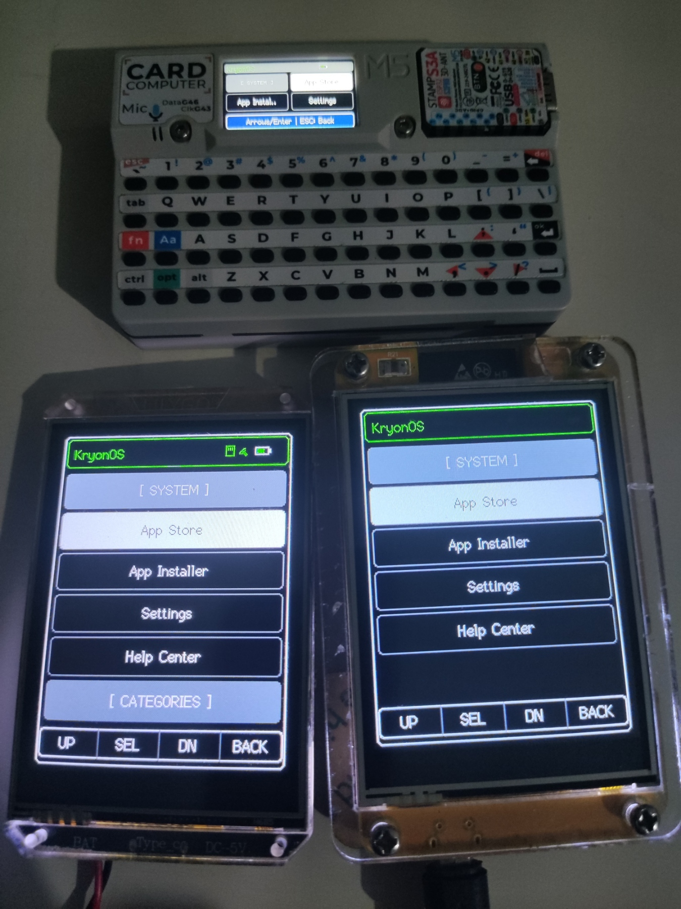
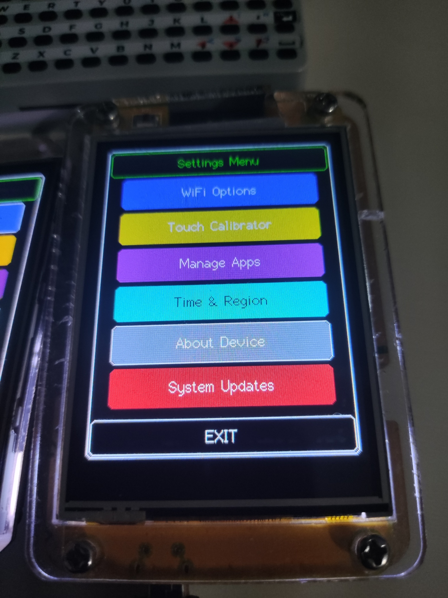

# KryonOS
KryonOS é um sistema operacional **open-source**, leve e de alta performance com interface gráfica (**GUI**), **Runtime duplo (JavaScript & Lua)** e **Emulador Web / IDE** projetado para a linha de microcontroladores ESP32. Ele oferece uma experiência completa de desktop e handhelds em sistemas embarcados, trazendo gerenciamento de arquivos, suporte a bibliotecas gráficas com double-buffering, calibração de toque, gerenciamento de bateria e arquitetura modular para suporte a múltiplos dispositivos.

---

## 📷 Hardware Showcase

| Múltiplos Dispositivos Rodando o KryonOS | M5Stack Cardputer | CYD (Cheap Yellow Display) | LilyGO T-HMI |
| :---: | :---: | :---: | :---: |
|  |  |  |  |

<p align="center">
  
</p>

---

## 🚀 Principais Funcionalidades

* **Execução Dual (JavaScript & Lua):** Suporte nativo para rodar aplicativos JS (engine ES5 com suporte assíncrono) e scripts Lua integrados via classe `LuaBindings` para manipulação de GPIO, primitivas gráficas, entradas de teclado e sistema de arquivos.
* **Web IDE & Emulador Integrado:** Desenvolva e teste códigos no navegador utilizando a IDE baseada em CodeMirror com autocompletar, popover de assinaturas de API (`signatures.js`) e emulador gráfico com suporte a eventos de toque.
* **LauncherUI Avançado:** Interface de inicialização com suporte a gerenciamento de categorias, navegação aprimorada e atualização dinâmica de itens.
* **Suporte Multi-Placa Nativo:** Ambientes pré-configurados no PlatformIO para **CYD (Cheap Yellow Display)**, **M5Stack Cardputer**, **LilyGO T-HMI** e **ESP32 Marauder**.
* **Gestão de Memória com PSRAM Fallback:** Alocação dinâmica inteligente com fallback automático para PSRAM e tela *About* paginada mostrando detalhes do sistema e da memória.
* **Gerenciamento de Bateria:** Leitura e monitoramento do estado de bateria para dispositivos portáteis (Cardputer, CYD).
* **Entradas de Teclado e Touch Calibrator:** Suporte nativo a teclados físicos com modificadores (`Shift`, `Fn` no Cardputer) e ferramenta interativa de calibração de tela sensível ao toque com validação.
* **VFS & Renderização de Bitmaps:** Sistema de Arquivos Virtual com suporte a leitura no cartão SD, salvamento de credenciais Wi-Fi e exibição de imagens bitmap.

---

## 💻 Placas e Hardware Suportados

* **Microcontroladores:** ESP32 (WROOM-32, ESP32-S2, ESP32-S3, ESP32-C3).
* **Placas Prontas (Out-of-the-box):**
  * **M5Stack Cardputer** (Display + Teclado físico integrado com teclas de atalho)
  * **CYD (Cheap Yellow Display / ESP32-2432S028)**
  * **LilyGO T-HMI**
  * **ESP32 Marauder (v4, v6 e v6.1)**
* **Telas e Controladores:** Display TFT ILI9341 2.8" (SPI), ST7789, controlador de toque XPT2046.
* **Módulos:** Leitor de Cartão MicroSD (SPI), Baterias integradas, Teclados físicos QWERTY.

---

## 🛠️ Como Adicionar um Novo Dispositivo (Placa)

O KryonOS possui uma arquitetura modular que facilita a inclusão de novas placas e telas. Para adicionar um novo dispositivo ao projeto, siga o passo a passo abaixo:

### Passo 1: Criar o arquivo de ambiente no PlatformIO
Crie um arquivo `.ini` na pasta `KryonOS/boards_config/{dispositivo}.ini` que herda as configurações gerais do `[env]` base.

**Exemplo (`KryonOS/boards_config/t_hmi.ini`):**
```ini
; =========================================================================
; AMBIENTE: LilyGO T-HMI (ESP32-S3 + ST7789 Paralelo 8-bit)
; =========================================================================
[env:HMI]
board = esp32-s3-devkitc-1
monitor_filters = esp32_exception_decoder
board_build.arduino.memory_type = qio_opi
build_type = debug

lib_deps =
    ${env.lib_deps}
    [https://github.com/PaulStoffregen/XPT2046_Touchscreen](https://github.com/PaulStoffregen/XPT2046_Touchscreen)@^1.4.0

build_src_filter = +<*> -<boards/> +<boards/t_hmi/>
build_flags =
    ${env.build_flags}
    -D TARGET_T_HMI=1
    -D ARDUINO_USB_MODE=1
    -D ARDUINO_USB_CDC_ON_BOOT=1
    -D BOARD_HAS_PSRAM
    -D ENABLE_MEM_OVERLAY

; --- Driver do Display (TFT_eSPI / Custom) ---
    -D USER_SETUP_ID=207
    -D ST7789_DRIVER=1
    -D TFT_PARALLEL_8_BIT=1
    -D TFT_CS=6
    -D TFT_DC=7
    -D TFT_WR=8
```

---

### Passo 2: Criar o Header da Placa (`BoardConfig.h`)
Crie a pasta `KryonOS/src/boards/{dispositivo}/` e insira o arquivo `BoardConfig.h` definindo a resolução e os pinos específicos da placa:

```cpp
#ifndef SEU_DISPOSITIVO_BOARD_CONFIG_H
#define SEU_DISPOSITIVO_BOARD_CONFIG_H

#include <Arduino.h>

// --- Resolução da Tela ---
#ifndef DISP_HOR_RES
#define DISP_HOR_RES TFT_WIDTH
#endif

#ifndef DISP_VER_RES
#define DISP_VER_RES TFT_HEIGHT
#endif

// --- Pinos de Alimentação, Touch e SD ---
#define PWR_EN_PIN  10
#define TFT_BL      38
#define BAT_ADC_PIN 5

#define TOUCHSCREEN_SCLK_PIN 1
#define TOUCHSCREEN_MISO_PIN 4
#define TOUCHSCREEN_MOSI_PIN 3
#define TOUCHSCREEN_CS_PIN   2

#endif
```

---

### Passo 3: Implementar o Código da Placa (`BoardConfig.cpp`)
Crie o arquivo `BoardConfig.cpp` na mesma pasta implementando os métodos de inicialização e controle da placa.

> **Importante:** Se a sua placa não possuir algum recurso específico (como Bateria, Teclado físico ou Touchscreen), **deixe as funções mocadas** retornando os valores padrão conforme o exemplo abaixo:

```cpp
#include "boards/Board.h"
#include "BoardConfig.h"
#include <SPI.h>

#ifdef TARGET_SEU_DISPOSITIVO

// Instância do Display
TFT_eSPI tft = TFT_eSPI();

// --- Métodos de Recurso (Mocar caso o dispositivo não suporte) ---
bool hasTouch(void) { return true; }
bool hasKeyboard(void) { return false; } // Mocado se não houver teclado
bool hasBattery(void) { return true; }

// --- Inicializações ---
void initHardware(void) {
    // Configuração inicial dos pinos de energia e backlight
    #if defined(TFT_BL)
        pinMode(TFT_BL, OUTPUT);
        digitalWrite(TFT_BL, HIGH);
    #endif
}

void initDisplay(void) {
    tft.init();
    tft.setRotation(0);
    tft.fillScreen(TFT_BLACK);
}

void initTouch(void) {
    // Inicialização do Touchscreen (se houver)
}

fs::FS* initSD(void) {
    // Inicialização do Cartão SD
    return nullptr; // Retorne &SD ou &SD_MMC se suportado
}

// --- Leitura de Bateria (Mocar se não houver) ---
float getBatteryVoltage(void) { return 4.2f; }
int getBatteryPercent(void) { return 100; }

// --- Leitura de Teclado (Mocar se não houver) ---
BoardKey getKeyInput(void) { return BOARD_KEY_NONE; }
void updateModifiers(BoardKey) {}
void clearModifiers() {}
char keyToChar(BoardKey) { return '\0'; }
bool isShiftActive() { return false; }
bool isFnActive() { return false; }

#endif
```

---

### Passo 4: Selecionar o Dispositivo no PlatformIO
Para compilar e gravar no seu novo dispositivo, basta rodar o comando referente ao ambiente criado:

```bash
pio run -e HMI -t upload
```

---

## 🔌 Conexões de Pinos e Arquitetura SPI

Para evitar colisões no barramento durante leitura do SD e atualização da tela em placas genéricas, o KryonOS utiliza **barramentos SPI divididos**:

* **VSPI:** Dedicado exclusivamente ao Display TFT e ao Controlador Touch.
* **HSPI:** Dedicado exclusivamente ao Módulo de Cartão MicroSD.

### Configuração Padrão de Pinos (ESP32 DevKit + ILI9341)

| Sinal / Função | Rótulo no Display ILI9341 | Pino ESP32 |
| :--- | :--- | :--- |
| **Alimentação** | VCC / GND | 3.3V / GND |
| **Controle TFT** | CS / RESET / DC | D17 / D5 / D16 |
| **Barramento Tela (VSPI)** | SDI (MOSI) / SCK / SDO (MISO) | D23 / D18 / D19 |
| **Backlight & Interrupt** | LED / T_IRQ | D32 / N.C. |
| **Touch Controller (VSPI)**| T_CLK / T_CS / T_DIN / T_DO | D18 / D21 / D23 / D19 |

### Cartão MicroSD (HSPI)
| Sinal SD Card | Pino ESP32 | Nota |
| :--- | :--- | :--- |
| **MOSI / MISO / SCK / CS** | GPIO 13 / GPIO 26 / GPIO 14 / GPIO 15 | Barramento HSPI |

---

## ⚡ Como Gravar (Flash)

### Opção 1: Arquivos Binários Pré-compilados
Faça o download das versões mais recentes na aba de [Releases](https://github.com/Haris16-code/KryonOS/releases) e grave utilizando o `esptool.py`:

```bash
esptool.py --chip esp32 --port COM3 --baud 921600 write_flash -z \
  0x1000 bootloader.bin \
  0x8000 partitions.bin \
  0x10000 firmware.bin
```

### Opção 2: Compilar do Código Fonte
1. Clone o repositório: `git clone https://github.com/Haris16-code/KryonOS.git`
2. Abra a pasta no **VS Code** com a extensão **PlatformIO** instalada.
3. Escolha o ambiente da sua placa e execute a gravação pelo comando `pio run -t upload`.

---

## 📚 Documentação & Comunidade

[](https://deepwiki.com/Haris16-code/KryonOS)
* [Guia de Desenvolvimento Lua & JS](./Documentation/App_Development_Guide.md) - Aprenda a criar aplicativos para o KryonOS.
* [Documentação da API System & LuaBindings](./Documentation/JS_API_Guide.md) - Referência de métodos para GPIO, Display, Teclado e Rede.
* [Emulador & IDE Web](./Documentation/Web_IDE.md) - Como utilizar o emulador integrado no navegador.
* [KryonOS Wiki](https://github.com/Haris16-code/KryonOS/wiki) - Manuais completos de arquitetura e schematics das placas.
* [Discussions](https://github.com/Haris16-code/KryonOS/discussions) - Tire dúvidas e compartilhe seus projetos com a comunidade.

---

## 📜 Licença

O KryonOS é licenciado sob a [GNU General Public License v3.0](./LICENSE).